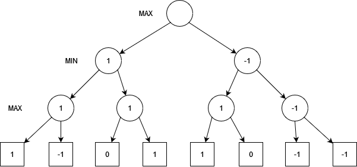
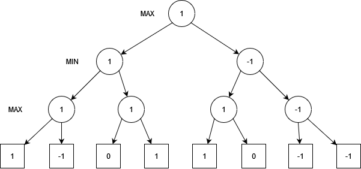

# Tic-tac-toe game with Minimax AI
Tic-tac-toe game with an AI powered by the Minimax algorithm.

Sample game:
```
Would you like to start or let the AI start?
[1] I will start
[2] Let AI start
[Q] Quit
> 2
1 | 2 | 3
4 | 5 | 6
7 | 8 | 9
AI played: 1 in 0.15596349999999992 seconds.
X | 2 | 3
4 | 5 | 6
7 | 8 | 9
Make your move! (Enter a number from 1-9)
> 2
X | O | 3
4 | 5 | 6
7 | 8 | 9
AI played: 4 in 0.006518899999999661 seconds.
X | O | 3
X | 5 | 6
7 | 8 | 9
Make your move! (Enter a number from 1-9)
> 7
X | O | 3
X | 5 | 6
O | 8 | 9
AI played: 5 in 0.000810400000000655 seconds.
X | O | 3
X | X | 6
O | 8 | 9
Make your move! (Enter a number from 1-9)
> 9
X | O | 3
X | X | 6
O | 8 | O
AI played: 6 in 0.0001318999999995185 seconds.
The AI has beaten you!
X | O | 3
X | X | X
O | 8 | O
```

## The Minimax Algorithm
Minimax is an algorithm used in games with two players (e.g. tic-tac-toe, chess, checkers), where one player is the *maximizer* and the other is the *minimizer*. In this case,
the 'X' is the maximizer and the 'O' is the minimizer.
While the maximizer aims to get the highest possible score, the minimizer aims for the opposite. The algorithm recursively goes through every possible move until it
reaches an end state (however, this is limited to a certain depth in bigger games like chess). Then, every end state is evaluated: if it is a win for X, or the maximizer, it gets
a score of 1. On the other hand, if it is a win for O, it gets a score of -1, while a tie gets a score of 0 (it favours none of the players). However, in games such as chess,
since it is not computationally efficient to look at the end states and label them as win or loss, there are *heuristic functions* defined that evaluate a given state and determines which
player has the advantage based on various properties. Nevertheless, in a game as simple as tic-tac-toe, there is no need to worry about that.

Consider the following image, which illustrates the algorithm:


Every node represents a state, and from every state the player's choice leads to a different state. The bottom layer consists of terminal nodes, those are states where the game has ended.
Each terminal node is labeled with a 1, 0, or -1, which evaluates whether it is a win for X, a tie, or a win for O, respectively.
We can see that the first turn is played by the maximizer, labeled with 'MAX'. Imagine the maximizer plays the move that leads to the node on its left. Now, it's the minimzer turn, and let's
imagine it also plays the move that leads to its left. Now, the maximizer has two options: play the move that leads to 1, or the one that leads to -1. Of course, since the maximizer wants to maximize their score, they will play the move that leads to 1. Hence, we can fill that decision node with 1, and do the same for the rest of the nodes, which will result in the following:


As you can see, the maximizer will win in almost every state, except the right one, where it has to choose between -1 and -1. Now, if we go one layer up, to where it's the minimzer's turn,
of course, the minimzer will choose the move that leads to the lowest score. We can repeat the process and get this as a result:


Now we are at the root node. Since the root node is the maximizing player, it will select the move that leads to the higher score, which is 1. Finally, this is the resulting graph:


This means that, in this particular scenario, the maximizer will always win **as long as they play optimally**. 

## Optimized with alpha-beta pruning
Although tic-tac-toe is a small game and does not require much computing power, the AI seemed to take a little while when making the first move. 
This is presumably due to the fact that the algorithm has to traverse every single child node until the leaves, which can add up quickly.
Without alpha-beta pruning, it took the AI around 4.50 seconds each time when making the first move. 
After implementing alpha-beta pruning, this time was decreased considerably, as it now only takes around 0.15 seconds.
All the subsequent moves also saw a decrease in time (e.g. second move average ~0.7 sec reduced to ~0.08 sec).

